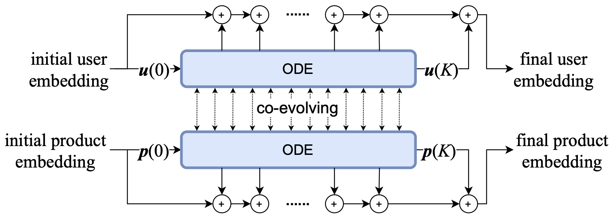
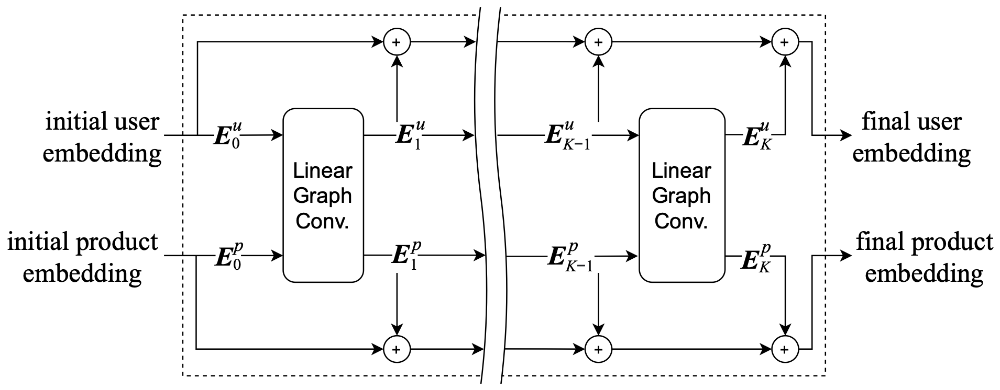

# LT-OCF: Learnable-Time ODE-based Collaborative Filtering

 
 [](https://arxiv.org/abs/2108.06208) [](https://hits.seeyoufarm.com)
 	
[](https://paperswithcode.com/sota/collaborative-filtering-on-gowalla?p=lt-ocf-learnable-time-ode-based-collaborative)[](https://paperswithcode.com/sota/collaborative-filtering-on-amazon-book?p=lt-ocf-learnable-time-ode-based-collaborative)[](https://paperswithcode.com/sota/collaborative-filtering-on-yelp2018?p=lt-ocf-learnable-time-ode-based-collaborative)
[](https://paperswithcode.com/sota/recommendation-systems-on-yelp2018?p=lt-ocf-learnable-time-ode-based-collaborative) [](https://paperswithcode.com/sota/recommendation-systems-on-amazon-book?p=lt-ocf-learnable-time-ode-based-collaborative) [](https://paperswithcode.com/sota/recommendation-systems-on-gowalla?p=lt-ocf-learnable-time-ode-based-collaborative)

For a more detailed explanation of our model, we recommend reading our Medium blog post:
  <a target="_blank" href="https://github-readme-medium-recent-article.vercel.app/medium/@jeongwhanchoi/0"> </a>

## Introduction

This is the official implementation of our CIKM 2021 paper "LT-OCF: Learnable-Time ODE-based Collaborative Filtering". LT-OCF is a novel approach to collaborative filtering that uses neural ordinary differential equations (NODEs) with learnable time points.

### LT-OCF vs LightGCN

LT-OCF |  LightGCN |
:-------------------------:|:-------------------------:
 | 

Our proposed LT-OCF model offers several advantages over LightGCN:

- **Continuous-time modeling**: LT-OCF uses ODEs to model embedding evolution in continuous time, while LightGCN uses discrete layers.
- **Co-evolving embeddings**: User and item embeddings evolve simultaneously through coupled ODEs in LT-OCF, enabling richer interactions.
- **Learnable time points**: LT-OCF allows flexible layer combinations with learnable time points, enhancing model adaptability.
- **Smooth evolution**: Embeddings in LT-OCF evolve smoothly from initial to final states, potentially capturing more nuanced patterns.

While LightGCN offers simplicity and computational efficiency, LT-OCF provides greater flexibility and expressive power in modeling collaborative filtering dynamics.

## Citation

If you find this work useful in your research, please consider citing:
```
@inproceedings{choi2021ltocf,
  title={LT-OCF: Learnable-Time ODE-based Collaborative Filtering},
  author={Choi, Jeongwhan and Jeon, Jinsung and Park, Noseong},
  booktitle={Proceedings of the 30th ACM International Conference on Information and Knowledge Management},
  year={2021}
}
```


## Setup
### Install python environment

```bash
conda env create -f environment.yml   
```
### Activate environment
```bash
conda activate lt-ocf
```

---

## Reproducibility
### Usage

#### In terminal
- Run the shell file (at the root of the project)
```bash
# run lt-ocf (gowalla dataset, rk4 solver, learnable time)
sh ltocf_gowalla_rk4.sh
```
```bash
# run lt-ocf (gowalla dataset, rk4 solver, fixed time)
sh ltocf_gowalla_rk4_fixed.sh
```

#### Key Arguments
- `--gpuid`
    - GPU ID (default: `0`)
- `--dataset`
    - Chose from `gowalla`, `yelp2018`, `amazon-book`
- `--model`
    - Use `ltocf`
- `--solver`
    - Chose from `euler`, `rk4`, `dopri5`
- `--adjoint`
    - `False` (default), `True`
- `--K`
    - Number of layers (1, 2, 3, **4**)
- `--learnable_time`
    - `True` (learnable) , `False` (fixed)
- `--dual_res`
    - `False` (default), `True`

For a full list of arguments, please refer to `parse.py`.


## Star History

[](https://star-history.com/#jeongwhanchoi/lt-ocf&Date)