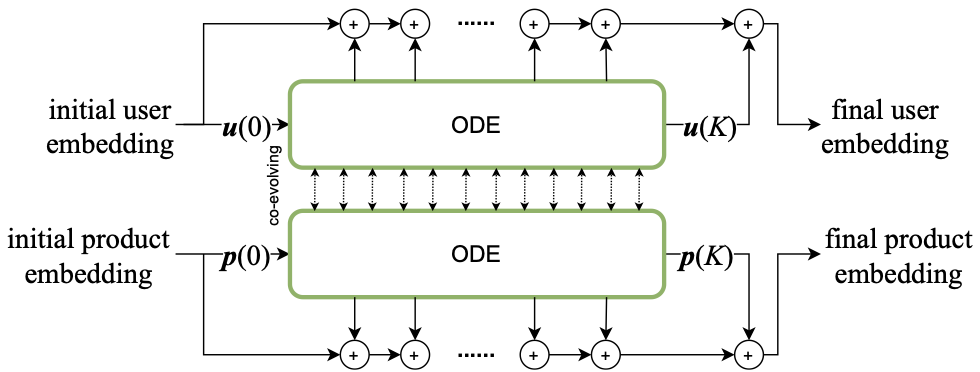
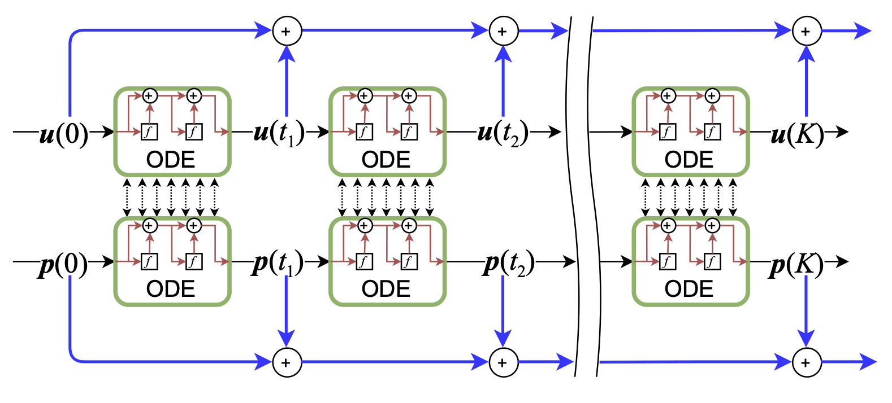

# LT-OCF: Learnable-Time ODE-based Collaborative Filtering

[](https://arxiv.org/abs/2108.06208) [](https://sites.google.com/view/npark/home?authuser=0)

## Introduction

This is the repository of our accepted CIKM 2021 paper "LT-OCF: Learnable-Time ODE-based Collaborative Filtering". Paper is available on [arxiv](https://arxiv.org/abs/2108.06208)

## Citation

Please cite our paper if using this code.

```
@inproceedings{choi2021ltocf,
  title={LT-OCF: Learnable-Time ODE-based Collaborative Filtering},
  author={Choi, Jeongwhan and Jeon, Jinsung and Park, Noseong},
  booktitle={Proceedings of the 30th ACM International Conference on Information and Knowledge Management},
  year={2021},
  organization={ACM}
}
```

## Our proposed LT-OCF

 

### Our proposed dual co-evolving ODE



---

## Setup Python environment for LT-OCF

### Install python environment

```bash
conda env create -f environment.yml   
```

### Activate environment
```bash
conda activate lt-ocf
```

---

## Reproducibility
### Usage

#### In terminal
- Run the shell file (at the root of the project)
```bash
# run lt-ocf (gowalla dataset, rk4 solver, learnable time)
sh ltocf_gowalla_rk4.sh
```
```bash
# run lt-ocf (gowalla dataset, rk4 solver, fixed time)
sh ltocf_gowalla_rk4_fixed.sh
```

#### Arguments (see more arguments in `parse.py`)
- gpuid
    - default: 0
- dataset
    - gowalla, yelp2018, amazon-book
- model
    - **ltocf**
- solver
    - euler, **rk4**, implicit_adams, dopri5
- adjoint
    - **False**, True
- K
    - 1, 2, 3, **4**
- learnable_time
    - True, False
- dual_res
    - **False**, True

---

## Authors

- Jeongwhan Choi (jeongwhan.choi@yonsei.ac.kr)
- Jinsung Jeon (jjsjjs0902@yonsei.ac.kr)
- Noseong Park (noseong@yonsei.ac.kr)
